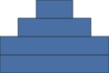
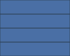
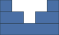
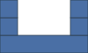
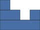
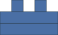

# A taxonomy of castle features

Each feature below is a function of the tower profile (the per-column height
above the base).  These are working definitions — the point of the Enfilade
Castle Zoo is to have names for shapes, so the exact formulations are open to
refinement.

## Convex

A castle is **convex** if its skyline is unimodal: it climbs to a (possibly
flat) peak and then descends.  This is the wiki's "front / middle / back"
shape — interspersed `U`/`R` steps up, at least one `R` at the top, then
interspersed `D`/`R` steps down.

```
..##..
.####.
######
######
```



Rectangles are convex (the degenerate flat peak):

```
#####
#####
#####
#####
```



## Concave

A castle is **concave** if its skyline is a single *strict* valley: it descends
to a dip and climbs back out.  The valley requirement keeps flat and monotonic
skylines from being called concave, so `is_convex` and `is_concave` are
disjoint.

```
#...#
##.##
#####
```



## Valleys

`num_valleys(castle)` counts the local minima of the skyline — a column that is
strictly lower than both neighbours.  `has_valley` is its boolean form.  The
double-tower castle below has one valley (the empty column 2); the concave
example above has one too.

```
#...#
#...#
#####
```



## Degree

`degree(castle)` is the number of blocks resting directly on the base — the
number of children of the root in the containment tree, i.e. the number of
maximal runs of columns with tower height at least 1.  The double-tower castle
has degree 2; a single full-width block has degree 1.

## Symmetry

A castle is **symmetric** if its profile is a palindrome (left-right mirror).
Note the asymmetric castle below — a valley but not mirrored.

```
#...
##.#
####
```



## Nicknames

`nickname(castle)` composes these into a short deterministic descriptor:

```python
>>> castles.nickname(castles.parse("UURDRURDD"))          # two sub-blocks
'symmetric concave 1-valley'
>>> castles.nickname(castles.Castle(4, 3, (2, 2, 2, 2)))  # rectangle
'symmetric convex'
```

A castle that is neither convex nor concave is "complex":

```
.#.#.
#####
#####
```



```python
>>> castles.nickname(castles.Castle(5, 3, (1, 2, 1, 2, 1)))
'symmetric complex 1-valley'
```
